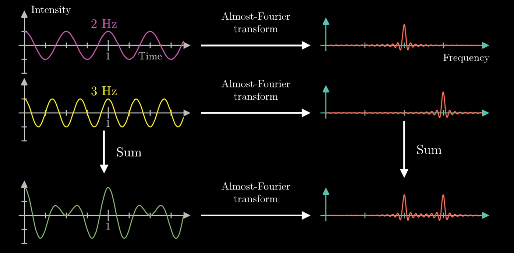

## Fourier transform

## Almost Fourier transform

## The Hilbert transform
The idea of this transform: alternative method for extracting information about magnitude and frequency.

## References
https://en.wikipedia.org/wiki/Envelope_detector

https://stackoverflow.com/questions/32220053/how-to-find-envelope-of-uneven-waveform
